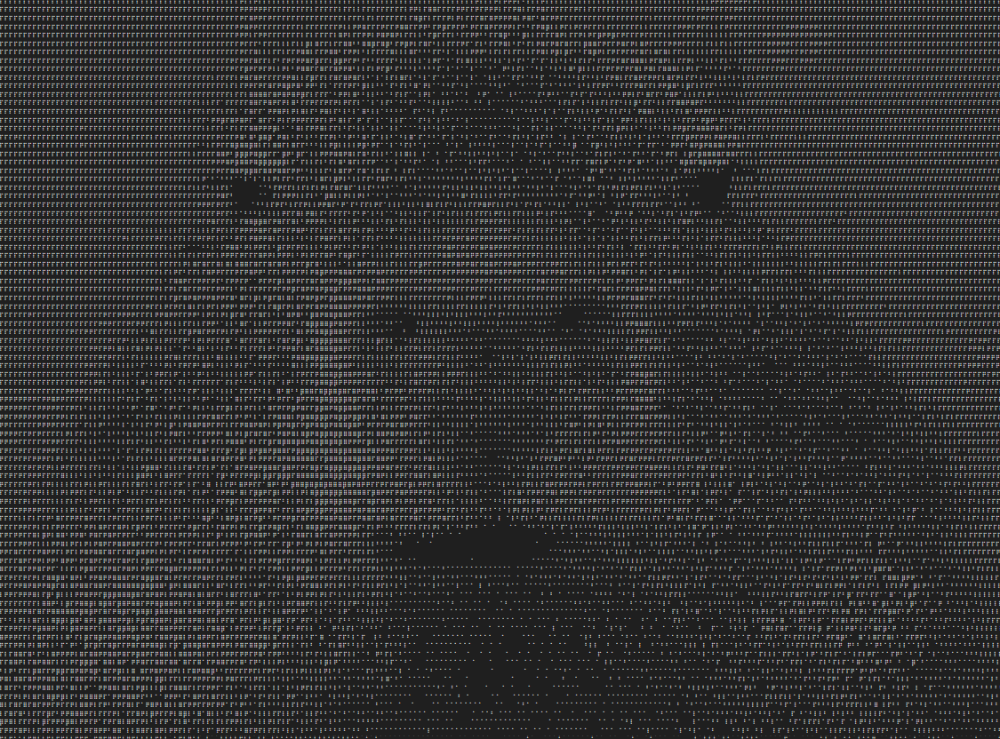
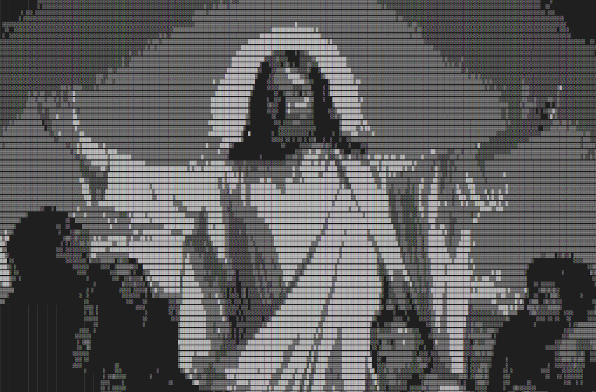
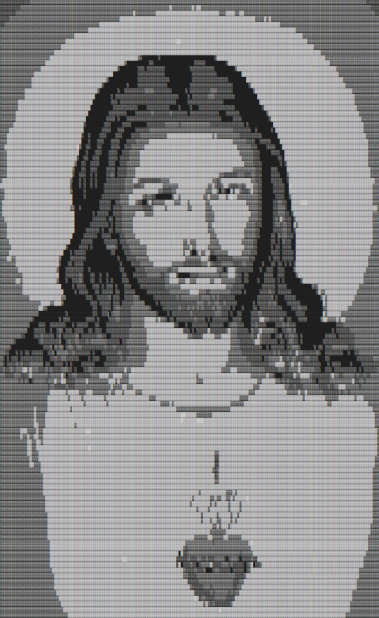
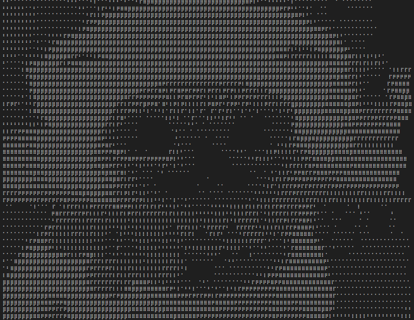
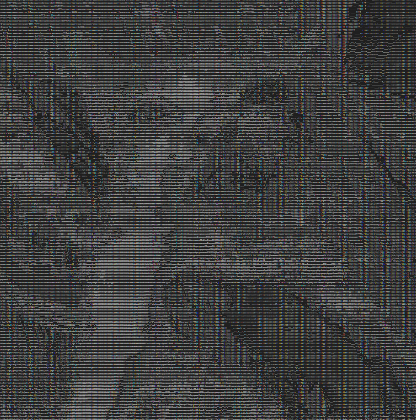

# bukvalno

## Usage

```
Image to ASCII Art Generator

Usage: bukvalno [OPTIONS] --file <FILE>

Options:
  -f, --file <FILE>        Sets the input image file
  -s, --scale <SCALE>      Sets the scale down factor [default: 1.0]
  -c, --charset <CHARSET>  Sets the charset ie. english, chinese, japanese, braille, circles, blocks [default: english]
  -i, --invert <INVERT>    Inverts the dark and light colors of the image [default: false]
  -h, --help               Print help
```

## Installation

> You must have `~/.cargo/bin/` in your `PATH` to run `bukvalno`
> directly.

```sh
cargo install bukvalno
```

## My Favorites

### Capybara


### Christ the Consoler by Carl Bloch


### The Sacred Heart of Jesus


### Smiling Dog


### Watermelon Cat

